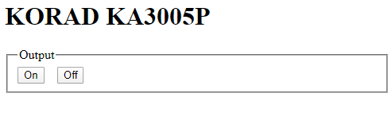

# korad-serial-web
Web control for KORAD KA3005P power supply

A simple webserver written in python that controls the KORAD KA3005P power
supply. I use it to control the output remotely.

It only supports changing the output state right now, but it should be easy to
implement new features.




## Installation
- install pyserial
  ```
  pip install pyserial
  ```
- clone https://github.com/starforgelabs/py-korad-serial
  ```
  git clone https://github.com/starforgelabs/py-korad-serial.git koradserial
  touch ./koradserial/__init__.py
  ```

## Favicon.ico
I downloaded the favicon.ico file [here](
http://www.iconarchive.com/show/outline-icons-by-iconsmind/Power-3-icon.html)
